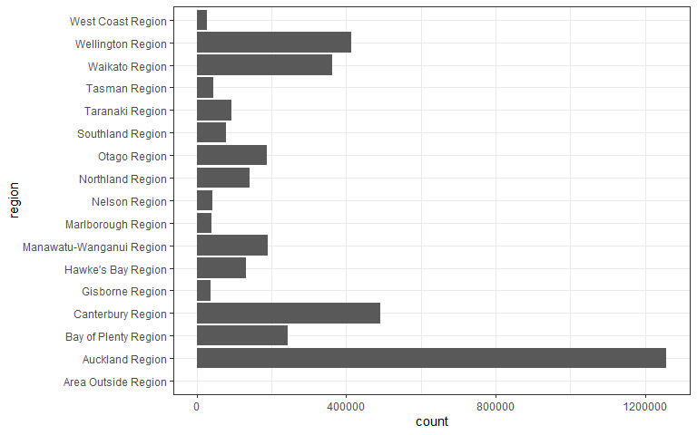

# **db.censusnz** (censusnz database plugin)

<!-- badges: start -->

[](https://gitlab.harmonic.co.nz/harmonic/databases/db-censusnz/)
[](https://gitlab.harmonic.co.nz/harmonic/databases/db-censusnz/pipelines)
<!-- badges: end -->

A way to access the 2018 NZ Census Data. This package includes datasets
of census responses grouped by different geographic areas.

In future, functions to help access the data will also exist.

## Installation

To install this package from gitlab, you must first generate a Personal
Access Token; the package can then be installed using via the Remotes
package:

``` r
Sys.setenv(GITLAB_PAT = "xxxxxxxxxxxxxxxxxxxx")
remotes::install_gitlab(repo = 'harmonic/packages/censusnz', host = 'gitlab.harmonic.co.nz/')
remotes::install_gitlab(repo = 'harmonic/databases/db-censusnz', host = 'gitlab.harmonic.co.nz/')
```

Alternatively the `utilic` package can be used:

``` r
utilic::install_harmonic('harmonic/packages/censusnz')
utilic::install_harmonic('harmonic/databases/db-censusnz')
```

-----

# Basic Usage of `db.censusnz`

To get started working with **censusnz**, instantiate a `DataModel`
object:

``` r
Census <- PackageDataModel$new()
```

There are two major functions implemented in **censusnz**:

1.  `Census$get_variables()` returns a table with the available
    *geographies* and *variables* you can query; and
2.  `Census$get_data()` fetches a table with selected variables.

## Geography in **censusnz**

To get Census data, **censusnz** users supply an argument to the
required `geography` parameter:

  - **SA1**: Statistical Area 1
  - **SA2**: Statistical Area 2
  - **WARD**: Ward
  - **DHB**: District Health Board
  - **LBA**: Local Board Area (Auckland region only)
  - **TA**: Territorial Authority
  - **RC**: Regional Council

See more information about the geographies by calling
`?censusnz::DataModel`. For comprehensive information check [StatNZ
report](http://archive.stats.govt.nz/%7B~%7D/media/Statistics/surveys-and-methods/methods/class-stnd/geographic-hierarchy/statistical-standard-for-geographic-areas-2018.pdf),
pages 8-21.

## Searching for Variables

Getting variables from the Census requires knowing the variable name -
and there are hundreds of these variables across the different Census
files. To rapidly search for variables, use the `get_variables()`
function. The function takes no arguments and outputs metadata of the
available geographies and variables.

``` r
head(Census$get_variables())
#> # A tibble: 6 x 5
#>   geography variable             category  subcategory concept                  
#>   <chr>     <chr>                <chr>     <chr>       <chr>                    
#> 1 DHB       usually_resident_po~ Individu~ 1           Census usually resident ~
#> 2 DHB       census_night_popula~ Individu~ 1           Census night population ~
#> 3 DHB       unit_record_data_so~ Individu~ 1           Unit record data source  
#> 4 DHB       sex                  Individu~ 1           Sex                      
#> 5 DHB       age_5_year_groups    Individu~ 1           Age in five-year groups,~
#> 6 DHB       median_age_curp      Individu~ 1           Age in broad groups
```

For ideal functionality, we recommend:

1)  Using the *View* function in RStudio to interactively browse for
    variables;
2)  Clicking on *filters*; and
3)  Typing a variable of interest.

<!-- end list -->

``` r
View(Census$get_variables())
```


For comprehensive variable description check [StatNZ Census
user-guide](https://www.stats.govt.nz/assets/Uploads/Methods/2018-Census-data-user-guide/2018-census-data-user-guide.pdf),
pages 12-14.

## Working with Census

Querying the Census data requires you to set three parameres:

1.  [`geography`](#geography);
2.  [`variables`](#variables); and
3.  `year` (currently, only 2018 is available).

Once you’ve figure out what you need, you can query the Census data with
`get_data()`. The result is a long table with six columns:

1.  `geoid`;
2.  `land_type`;
3.  `name`;
4.  `variable`;
5.  `variable_group`; and
6.  `count`.

In the following example we query two variables, *maori\_descent* and
*smoking\_status*, from a regional council geography level.

``` r
query <- Census$get_data(
  geography = "RC", 
  variables = c("maori_descent", "smoking_status")
)

head(query, 10)
#> # A tibble: 10 x 6
#>    geoid land_type name        variable    variable_group                  count
#>    <chr> <chr>     <chr>       <chr>       <chr>                           <dbl>
#>  1 01    Mixture   Northland ~ maori_desc~ 01_maori_descent_curp           69225
#>  2 01    Mixture   Northland ~ maori_desc~ 02_no_maori_descent_curp       104586
#>  3 01    Mixture   Northland ~ maori_desc~ 04_dont_know_curp                5268
#>  4 01    Mixture   Northland ~ maori_desc~ total_stated_curp              179076
#>  5 01    Mixture   Northland ~ maori_desc~ 99_not_elsewhere_included_curp      0
#>  6 01    Mixture   Northland ~ maori_desc~ total_curp                     179076
#>  7 01    Mixture   Northland ~ smoking_st~ 01_regular_smoker_curp_15year~  25800
#>  8 01    Mixture   Northland ~ smoking_st~ 02_ex_smoker_curp_15years_and~  39639
#>  9 01    Mixture   Northland ~ smoking_st~ 03_never_smoked_regularly_cur~  76011
#> 10 01    Mixture   Northland ~ smoking_st~ total_stated_curp_15years_and~ 141453
```

Not all geographies are available for all surveys, all years, and all
variables. Most Census geographies are supported in **censusnz** at the
moment; if you require a geography that is missing from the table above,
please file an issue at
<https://gitlab.harmonic.co.nz/harmonic/databases/db-censusnz/issues>

## Visualising Census Data

The Census contains totals and their components. The totals are a
convenient way to:

  - Transform absolute numbers into percentage; and
  - Use an aggregate level of *variable\_group*.

In this example we plot the total number of smokers in each region
within NZ. Our definition of a smoker is anyone who smokes, regularly or
occasionally, or used to smoke. This means:

  - We need the total number of smokers, regardless of their current
    smoking habit; and
  - We need the number of smokers per region, rather than the total of
    all regions.

For the first point, we need to filter, i.e. include, the totals. We do
that by using

``` r
filter_at("variable_group", ~ grepl("^total_stated_", .))
```

For the second point, we need to filter out, i.e. discard, the total
smokers in all regions combined. We do that by using

``` r
filter_at("name", ~ !grepl("^Total NZ", .))
```

``` r
(
    ggdata <- query 
    %>% dplyr::filter(variable %in% "smoking_status")
    %>% dplyr::filter_at("name", ~ !grepl("^Total NZ", .))
    %>% dplyr::filter_at("variable_group", ~ grepl("^total_stated_", .))  
)
#> # A tibble: 17 x 6
#>    geoid land_type name             variable     variable_group            count
#>    <chr> <chr>     <chr>            <chr>        <chr>                     <dbl>
#>  1 01    Mixture   Northland Region smoking_sta~ total_stated_curp_15yea~ 1.41e5
#>  2 02    Mixture   Auckland Region  smoking_sta~ total_stated_curp_15yea~ 1.26e6
#>  3 03    Mixture   Waikato Region   smoking_sta~ total_stated_curp_15yea~ 3.61e5
#>  4 04    Mixture   Bay of Plenty R~ smoking_sta~ total_stated_curp_15yea~ 2.44e5
#>  5 05    Mixture   Gisborne Region  smoking_sta~ total_stated_curp_15yea~ 3.62e4
#>  6 06    Mixture   Hawke's Bay Reg~ smoking_sta~ total_stated_curp_15yea~ 1.31e5
#>  7 07    Mixture   Taranaki Region  smoking_sta~ total_stated_curp_15yea~ 9.29e4
#>  8 08    Mixture   Manawatu-Wangan~ smoking_sta~ total_stated_curp_15yea~ 1.91e5
#>  9 09    Mixture   Wellington Regi~ smoking_sta~ total_stated_curp_15yea~ 4.13e5
#> 10 12    Mixture   West Coast Regi~ smoking_sta~ total_stated_curp_15yea~ 2.60e4
#> 11 13    Mixture   Canterbury Regi~ smoking_sta~ total_stated_curp_15yea~ 4.91e5
#> 12 14    Mixture   Otago Region     smoking_sta~ total_stated_curp_15yea~ 1.88e5
#> 13 15    Mixture   Southland Region smoking_sta~ total_stated_curp_15yea~ 7.80e4
#> 14 16    Mixture   Tasman Region    smoking_sta~ total_stated_curp_15yea~ 4.29e4
#> 15 17    Mixture   Nelson Region    smoking_sta~ total_stated_curp_15yea~ 4.19e4
#> 16 18    Mixture   Marlborough Reg~ smoking_sta~ total_stated_curp_15yea~ 3.91e4
#> 17 99    Mixture   Area Outside Re~ smoking_sta~ total_stated_curp_15yea~ 5.55e2
```

Plotting the filtered data we get

``` r
library(ggplot2)
(
    ggdata %>% ggplot(aes(x=name, y=count)) 
    + geom_col()
    + xlab("region")
    + coord_flip()
    + theme_bw()
)
```



<!-- # References -->
